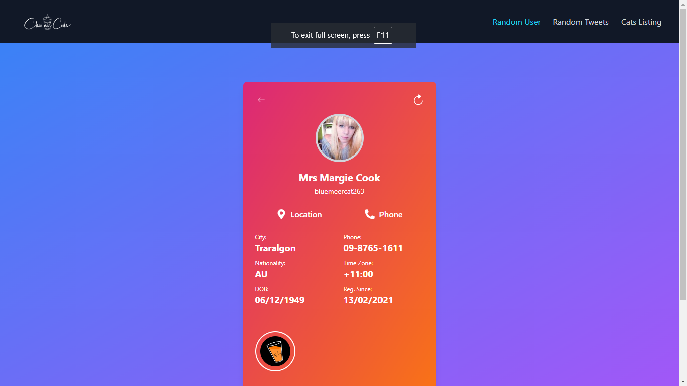
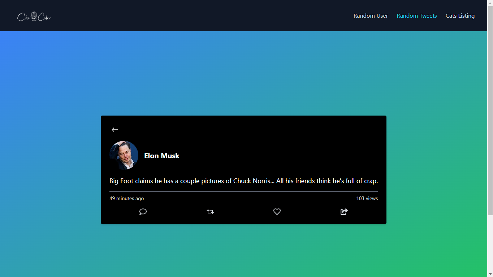
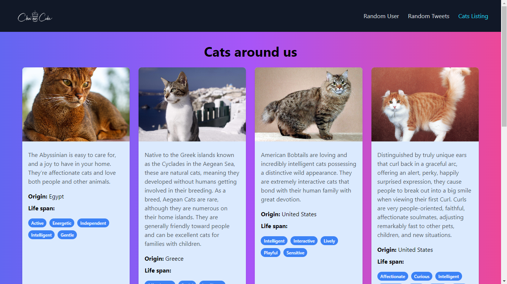

Welcome to the repository for My Project. This project is a demonstration of several web development techniques including API integration, dynamic content rendering, and responsive design.

Table of Contents
Project Overview
Features
Random User Profile
Random Jokes Tweet
Cats Listing
Screenshots
Installation
Usage
Technologies Used
Live Demo
License
Project Overview
This project showcases:

Random User Profiles: Fetching and displaying user data with links to call or view locations.
Random Jokes Tweet: Simulating a tweet with dynamically generated data.
Cats Listing: A paginated list of cat profiles with a smooth horizontal scroll.
The project is designed to be responsive and visually appealing while demonstrating practical usage of APIs.

Features
Random User Profile
Dynamic User Data: Fetches random user profiles from an API.
Styling: Matches the design provided in Figma.
Hyperlinks: Links for location and call open in a new tab.
Loading State: Displays a loading animation while data is being fetched.
Random Jokes Tweet
Static Author Details: Author details are hardcoded.
Dynamic Analytics: Randomly generated timestamp, views, date, and other metrics.
Loading State: Custom loading animation during data retrieval.
New Data on Reload: Fetches a new joke on page reload.
Cats Listing
Paginated Horizontal Scroll: Cards holding cat information are displayed with horizontal scroll and pagination.
Loading State: Shows a loading animation while fetching data.
API Integration: Fetches data from the Cats API and displays it in a user-friendly format.

Screenshots

Check out the live demo of the project here: "I had an error in deploying it and i am last minute"